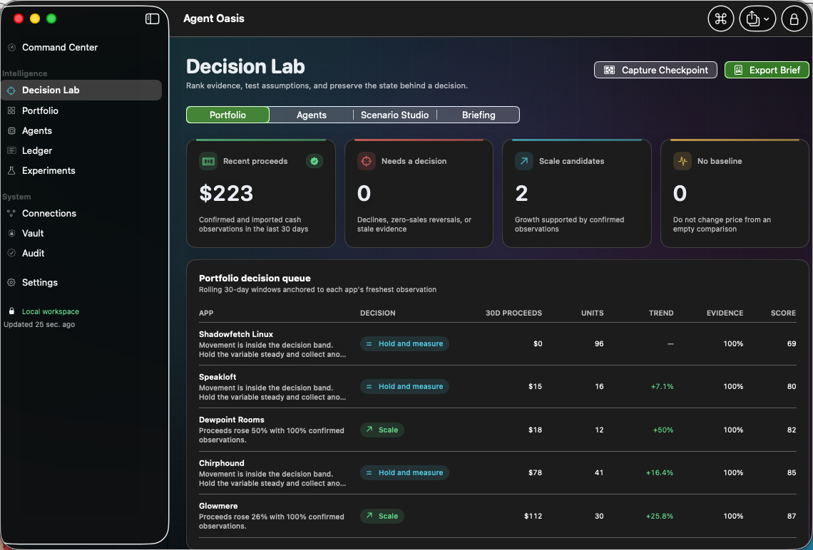

# Agent Oasis

**Private decision intelligence for products, agents, costs, and experiments.**

Agent Oasis is a native macOS workspace for operators who need to understand what is
working, what is costing money, and what deserves the next decision. It keeps the source
data, assumptions, checkpoints, and conclusions together in one encrypted local file.

No Agent Oasis account. No Shadowfetch server. No telemetry. No subscription.

macOS 14+ | Apple silicon and Intel | SwiftUI + Charts | MIT licensed

[Download the latest signed release](https://github.com/ShadowfetchAI/agent-oasis/releases/latest) |
[Product page](https://www.shadowfetch.com/agent-oasis) |
[Setup](SETUP.md) |
[Security model](docs/SECURITY.md)



## Agent Oasis 2.0

Version 2.0 turns the original encrypted operating ledger into a decision workspace.

### Decision Lab

- **Portfolio queue** ranks products from current evidence and names the next posture:
  scale, hold and measure, investigate, refresh evidence, or establish a baseline.
- **Agent frontier** compares measured operating cost, supervision, capacity value, and
  evidence quality without pretending modelled labor is cash.
- **Scenario Studio** tests price, volume, cost, and agent-capacity assumptions with
  downside, plan, and upside cases plus break-even units.
- **Checkpoints** preserve the workspace state behind a decision so later results can be
  compared with what was known at the time.
- **Executive briefs** export a self-contained HTML or Markdown report while excluding
  vault values and API secrets.

### Live read-only sales evidence

Agent Oasis can now download Apple's latest available daily Summary Sales report directly
from the documented App Store Connect API. The response is decoded locally, imported
idempotently, and linked to the matching product as confirmed evidence.

App-record access and Sales and Reports access can use separate API keys. This lets an
operator grant only the privileges needed for each job. Manual CSV/TSV import remains
available and uses the same preview and duplicate-protection pipeline.

See [App Store Connect setup](docs/APP-STORE-CONNECT.md).

## A strict accounting boundary

Agent Oasis does not manufacture a persuasive number by adding unlike things together.

| Class | Meaning |
|---|---|
| **Cash** | Money that actually moved: imported proceeds and recorded expenses |
| **Modelled value** | Capacity, avoided spend, or revenue influence used for planning |
| **Measured evidence** | Imported or observed data that can be traced to a source |
| **Estimated evidence** | A human-entered assumption that remains visibly labelled |

Cash and modelled value are displayed separately and never combined into a single ROI.
Experiment attribution is refused when a recorded confounder makes the lift ambiguous.
Confidence measures evidence quality and freshness, not activity volume.

Currency is also a hard boundary. Workspace cash totals include only the selected base
currency. Foreign-currency entries remain intact and are disclosed as excluded until the
operator converts them outside Agent Oasis and imports the result. The app never applies a
hidden exchange rate.

## Core workspace

- **Command Center** - honest cash, modelled value, coverage, trends, and an actionable
  Attention Inbox
- **Hermes Fleet** - a live agentic-operations dashboard: kanban shape and its oldest blockers,
  the open decision queue by authority level, roster, gateway liveness, and fleet structural
  integrity, all read over SSH with no aggregate invented where none exists. See
  [docs/HERMES-FLEET.md](docs/HERMES-FLEET.md).
- **Decision Lab** - portfolio postures, Agent Frontier cash-vs-modelled split, Scenario Studio,
  checkpoints, and executive briefs
- **Portfolio** - products, price history, observations, costs, proceeds, and source notes
- **Agents** - local and Hermes-agent costs, supervision, outcomes, and evidence provenance
- **Ledger** - income and expenses with currency, source, confidence, and audit history
- **Experiments** - baselines, variants, confounders, outcomes, and attribution status
- **Connections** - read-only App Store Connect and read-only SSH fleet telemetry
- **Vault** - encrypted API keys and local secret references
- **Audit** - append-only, hash-chained event history with tamper detection

Fast operation is built in: Command Palette with `Command-K`, section navigation with
`Command-1` through `Command-0`, contextual create, previewed imports, exports, and immediate
lock.

## Privacy and security

- AES-256-GCM workspace encryption before data reaches disk
- Owner-only `0600` workspace and backup files
- Encryption key stored in the macOS Keychain
- Touch ID or Mac password owner gate
- Auto-lock on inactivity, sleep, and screen lock
- Short-lived ES256 App Store Connect tokens generated in process
- API secrets excluded from audit summaries and exported executive briefs
- Credential inventory reads metadata only, never credential contents
- Hardened Runtime and Developer ID signing in official releases

The app is directly distributed and intentionally not sandboxed because optional Hermes
fleet telemetry invokes `/usr/bin/ssh`. The complete threat model and limitations are in
[docs/SECURITY.md](docs/SECURITY.md).

## Install

Download the signed and notarized DMG from
[GitHub Releases](https://github.com/ShadowfetchAI/agent-oasis/releases/latest), open it,
and drag Agent Oasis to Applications. Gatekeeper verification is part of the release
pipeline. The app is universal for Apple silicon and Intel Macs.

Agent Oasis opens to an empty workspace. It never ships sample company, revenue, or agent
records in the product binary.

## Build from source

Requires Xcode 16+ and [XcodeGen](https://github.com/yonaskolb/XcodeGen).
`project.yml` is the source of truth; the generated Xcode project is not committed.

```sh
brew install xcodegen
git clone https://github.com/ShadowfetchAI/agent-oasis.git
cd agent-oasis
xcodegen generate
xcodebuild -project AgentOasis.xcodeproj -scheme AgentOasis \
  -destination 'platform=macOS' -derivedDataPath DerivedData \
  CODE_SIGNING_ALLOWED=NO test
```

The repository does not pin a developer team. Set your own bundle prefix and team only when
you want to sign a personal build; see [SETUP.md](SETUP.md).

## Verification

The 3.0 test suite contains 80 tests covering:

- encryption, wrong-key rejection, authenticated tamper detection, and owner-only files
- recovery while locked out, failed-restore atomicity, and pre-destructive snapshots
- App Store Connect JWTs, pagination, Apple gzip reports, and documented query filters
- per-unit proceeds arithmetic, currency separation, and import idempotency
- decision ranking, stale evidence, scenario break-even, and checkpoint deltas
- cash/modelled-value separation and foreign-currency exclusion
- audit-chain rewriting/removal detection and secret-free executive briefs
- delimited-text edge cases, fleet path injection rejection, and no sample generator in the
  application target
- Hermes Fleet: kanban/decision JSON parsing, the redaction guarantee that card and decision
  body text never decodes into the app, roster and gateway text-table parsing, and injection
  rejection for every configurable remote path

```sh
xcodegen generate
xcodebuild -project AgentOasis.xcodeproj -scheme AgentOasis \
  -destination 'platform=macOS' -derivedDataPath DerivedData \
  CODE_SIGNING_ALLOWED=NO test
```

## Documentation

- [Setup and first run](SETUP.md)
- [Hermes Fleet integration](docs/HERMES-FLEET.md)
- [Decision Lab](docs/DECISION-LAB.md)
- [App Store Connect integration](docs/APP-STORE-CONNECT.md)
- [Security model](docs/SECURITY.md)
- [Data and accounting contract](docs/DATA-CONTRACT.md)
- [Release history](CHANGELOG.md)

## License

MIT. See [LICENSE](LICENSE).
